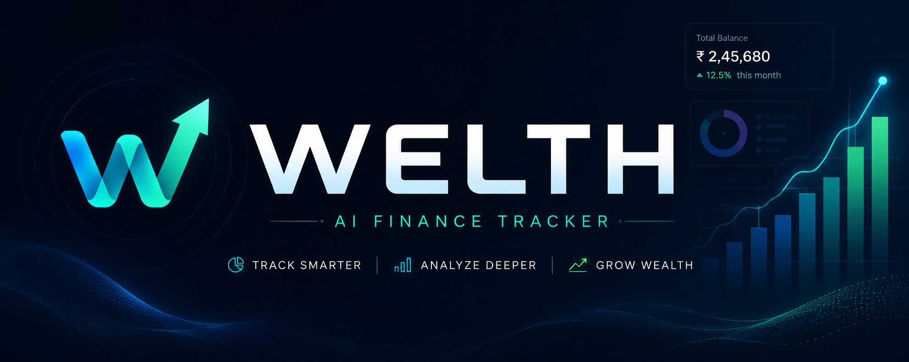

# Welth — AI-Powered Financial Management Platform

<div align="center">



[](https://nextjs.org/)
[](https://react.dev/)
[](https://tailwindcss.com/)
[](https://www.prisma.io/)
[](https://supabase.com/)
[](https://ai.google.dev/)
[](https://clerk.com/)
[](https://www.inngest.com/)
[](https://arcjet.com/)
[](https://resend.com/)

**An intelligent, full-stack financial SaaS platform that empowers users to track, analyze, and optimize personal finances with real-time AI receipt scanning, automated budget alerts, recurring transaction pipelines, and monthly AI financial reports.**

</div>

---

## 📌 Table of Contents
- [Executive Overview](#-executive-overview)
- [Key Features](#-key-features)
- [Tech Stack](#-tech-stack)
- [Database Schema & Data Model](#-database-schema--data-model)
- [Folder Structure](#-folder-structure)
- [Background Workflows & Cron Jobs](#-background-workflows--cron-jobs)
- [Security & Rate Limiting](#-security--rate-limiting)

---

## 🚀 Executive Overview

**Welth** was built to eliminate the tedious manual effort in personal accounting. By combining **Google Gemini Vision AI**, **Inngest Event-Driven Workflows**, and **Next.js Server Actions**, Welth delivers an automated financial copilot:

1. **Instant Receipt Scanning**: Upload a receipt photo or capture it on mobile; Gemini AI extracts amount, merchant, date, and category in seconds.
2. **Autonomous Background Workers**: Inngest processes recurring expenses on schedule and monitors budgets every 6 hours.
3. **Monthly Financial Insights**: Gemini analyzes user spending patterns each month and delivers customized tips via Resend HTML emails.
4. **Enterprise-Grade Protection**: Clerk handles secure authentication, while Arcjet guards server actions with bot detection and rate limiting.

---

## 🌟 Key Features

### 📸 1. AI-Powered Receipt Scanner
- Powered by **Google Gemini 3.6 Flash Multimodal AI**.
- Analyzes uploaded receipt images (PNG, JPEG, WebP) directly through Next.js Server Actions.
- Extracts total amount, transaction date, merchant/store name, description, and automatically assigns one of 14 standard expense categories.
- Auto-populates the transaction form with sub-second turnaround.

### 💳 2. Multi-Account & Balance Management
- Create multiple accounts: **Checking**, **Savings**, and **Investment**.
- Designate default accounts for budget tracking and automatic balance recalculations.
- Atomic balance adjustments executed via Prisma database transactions (`db.$transaction`).

### 📊 3. Interactive Analytics & Insights Dashboard
- Visual breakdown of expenses by category with interactive **Recharts** visualizations.
- Income vs. Expense monthly progression graphs.
- Real-time budget progress bar showing spent amount, remaining allowance, and percentage utilized.

### 🔄 4. Recurring Transaction Engine
- Supports **Daily**, **Weekly**, **Monthly**, and **Yearly** recurrence intervals.
- Automated daily batch cron via Inngest scans due recurring transactions and applies balance updates with per-user throttling.

### 🚨 5. Real-Time Budget Alert System
- Inngest scheduled job runs every 6 hours to monitor spending against active monthly budgets.
- Automatically sends a styled **Budget Alert Email** via Resend when expenses cross the **80% threshold**.
- Built-in monthly deduplication to avoid email spam.

### 📬 6. Monthly AI Financial Reports
- Triggered automatically on the 1st of every month.
- Aggregates monthly income, expenses, and category breakdown.
- Sends data to Gemini AI to generate 3 tailored, actionable financial recommendations.
- Renders responsive, branded email reports using **React Email** and dispatches via **Resend**.

---

## 💻 Tech Stack

| Domain | Technology | Purpose |
|---|---|---|
| **Framework** | **Next.js 15 (App Router)** | Hybrid Server/Client rendering, Server Actions, Turbopack |
| **Frontend UI** | **React 19, Tailwind CSS v4** | Modern reactive UI, utility-first styling |
| **Component Library**| **Radix UI / Shadcn UI** | Accessible primitives (Dialog, Drawer, Select, Tooltip, Sonner) |
| **Charts** | **Recharts** | Responsive charts for category and monthly cash flow |
| **Authentication** | **Clerk** | Secure authentication, multi-session support, route middleware |
| **Database & ORM** | **PostgreSQL (Supabase) + Prisma** | Relational database with Prisma connection pooling |
| **AI Vision Engine** | **Google Gemini 3.6 Flash** | Multimodal receipt extraction & automated financial analysis |
| **Background Jobs** | **Inngest v4** | Serverless cron jobs, recurring transaction triggers, throttling |
| **Email Engine** | **Resend + @react-email/components**| Declarative, responsive transactional HTML emails |
| **Security & Shield** | **Arcjet** | Bot protection, shield defense, token-bucket rate limiting |
| **Form Validation** | **React Hook Form + Zod** | Client/server form validation and schema parsing |

---

## 🗄️ Database Schema & Data Model

The database is built on **PostgreSQL** and managed using **Prisma ORM**:

```prisma
enum AccountType {
  CURRENT
  SAVINGS
}

enum TransactionType {
  INCOME
  EXPENSE
}

enum RecurringInterval {
  DAILY
  WEEKLY
  MONTHLY
  YEARLY
}

enum TransactionStatus {
  PENDING
  COMPLETED
  FAILED
}

model User {
  id           String        @id @default(uuid())
  clerkUserId  String        @unique
  email        String        @unique
  name         String?
  imageUrl     String?
  transactions Transaction[]
  accounts     Account[]
  budgets      Budget[]
  createdAt    DateTime      @default(now())
  updatedAt    DateTime      @updatedAt
}

model Account {
  id           String        @id @default(uuid())
  name         String
  type         AccountType
  balance      Decimal       @default(0)
  isDefault    Boolean       @default(false)
  userId       String
  user         User          @relation(fields: [userId], references: [id], onDelete: Cascade)
  transactions Transaction[]
  createdAt    DateTime      @default(now())
  updatedAt    DateTime      @updatedAt
}

model Transaction {
  id                String             @id @default(uuid())
  type              TransactionType
  amount            Decimal
  description       String?
  date              DateTime
  category          String
  receiptUrl        String?
  isRecurring       Boolean            @default(false)
  recurringInterval RecurringInterval?
  nextRecurringDate DateTime?
  lastProcessed     DateTime?
  status            TransactionStatus  @default(COMPLETED)
  userId            String
  user              User               @relation(fields: [userId], references: [id], onDelete: Cascade)
  accountId         String
  account           Account            @relation(fields: [accountId], references: [id], onDelete: Cascade)
  createdAt         DateTime           @default(now())
  updatedAt         DateTime           @updatedAt
}

model Budget {
  id            String    @id @default(uuid())
  amount        Decimal
  lastAlertSent DateTime?
  userId        String    @unique
  user          User      @relation(fields: [userId], references: [id], onDelete: Cascade)
  createdAt     DateTime  @default(now())
  updatedAt     DateTime  @updatedAt
}
```

---

## 📁 Folder Structure

```
my-app/
├── actions/                   # Next.js Server Actions (Mutations & Queries)
│   ├── account.js             # Account creation, default switching, stats
│   ├── budget.js              # Budget creation & threshold tracking
│   ├── dashboard.js           # Aggregated financial analytics & metrics
│   ├── send-email.js          # Resend email dispatcher with dev fallback
│   └── transaction.js         # Transaction CRUD & Gemini Receipt Scanner
├── app/                       # Next.js App Router
│   ├── (auth)/                # Clerk Auth Pages (/sign-in, /sign-up)
│   ├── (main)/                # Authenticated Application Routes
│   │   ├── account/[id]/      # Account details & transaction table
│   │   ├── dashboard/         # Dashboard with charts & budget cards
│   │   └── transaction/       # Create transaction & receipt scanner
│   ├── api/
│   │   └── inngest/route.js   # Inngest serve handler endpoint
│   ├── layout.js              # Root application layout with providers
│   └── page.jsx               # High-converting landing page
├── components/                # Modular UI Components
│   ├── ui/                    # Shadcn/Radix accessible UI primitives
│   ├── header.jsx             # Navigation header with Clerk UserButton
│   ├── hero.jsx               # Hero banner section
│   └── create-account-drawer.jsx
├── data/                      # Categories, mock data & static configs
├── emails/                    # React Email templates
│   └── template.jsx           # Budget alert & Monthly report email templates
├── lib/                       # Third-party integrations & utilities
│   ├── arcjet.js              # Arcjet bot detection & rate limiting rules
│   ├── checkUser.js           # Clerk-to-Prisma user sync utility
│   ├── prisma.js              # Prisma Client instance with connection pooling
│   └── inngest/
│       ├── client.js          # Inngest client configuration
│       └── function.js        # Background cron jobs & event workflows
└── prisma/
    └── schema.prisma          # Prisma schema definition
```

---

## ⚡ Background Workflows & Cron Jobs

Welth leverages **Inngest** to execute reliable serverless background workflows without managing infrastructure:

| Function ID | Trigger | Description |
|---|---|---|
| `trigger-recurring-transactions` | Cron: `0 0 * * *` (Midnight) | Queries due recurring transactions and dispatches batch processing events. |
| `process-recurring-transaction` | Event: `transaction.recurring.process` | Creates recurring transaction record, adjusts balance, and calculates next execution date (Throttled: 10/min per user). |
| `check-budget-alerts` | Cron: `0 */6 * * *` (Every 6h) | Calculates month-to-date spending vs. budget. Sends threshold warning email when $\ge 80\%$. |
| `generate-monthly-reports` | Cron: `0 0 1 * *` (1st of month) | Aggregates prior month's income/expenses, asks Gemini AI for 3 customized financial insights, and dispatches HTML reports via Resend. |

---

## 🛡️ Security & Rate Limiting

- **Shield Protection & Bot Detection**: Arcjet analyzes incoming requests, shielding the platform from automated scrapers and malicious bots while permitting trusted search engines and Inngest webhooks.
- **Server Action Protection**: Rate limiting is enforced on critical operations like transaction creation using token buckets.
- **Authentication**: Route-level protection via Clerk middleware (`isProtectedRoute`) redirects unauthenticated requests while keeping webhooks and public landing pages accessible.
- **Database Safety**: All balance mutations are wrapped inside atomic Prisma transactions to prevent race conditions or partial balance updates.

---

## 👤 Author
- **Subhash Bharti** — [GitHub](https://github.com/Subhashh01)

---

## 📄 License
This project is licensed under the MIT License.
